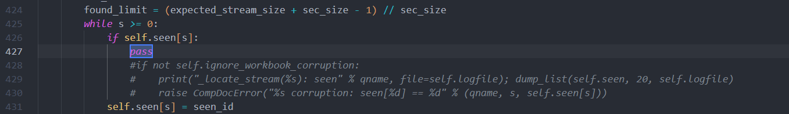

# Konfigurasi Project AOD

Berikut adalah langkah-langkah konfigurasi untuk memulai project AOD.

## 1. Install GDAL

Untuk menginstal GDAL dan dependensinya, jalankan perintah berikut di terminal:

```bash
sudo apt-get install gdal-bin libgdal-dev
```

## 2. Install PostgreSQL, PostGIS, dan Dependencies

Install PostgreSQL, PostGIS, dan seluruh package yang terdaftar di `requirements.txt` dengan menjalankan perintah berikut:

```bash
sudo apt-get install postgresql postgis
pip install -r requirements.txt
```

## 3. Konfigurasi Database

### 3.1. Buat Database, User, dan Password

Masuk ke PostgreSQL dan buat database, user, dan password sesuai dengan yang tertera di `Aod-project/settings.py`:

```bash
psql -U postgres
```

Setelah masuk ke PostgreSQL, buat database dan user sebagai berikut:

```sql
CREATE DATABASE aodproject;
CREATE USER aoduser WITH PASSWORD 'tioninta';
GRANT ALL PRIVILEGES ON DATABASE aodproject TO aoduser;
ALTER ROLE aoduser WITH SUPERUSER;
```

### 3.2. Install Ekstensi PostGIS dan PostGIS Raster

Setelah database dan user selesai dibuat, masuk ke database yang baru dibuat dan install ekstensi PostGIS dan PostGIS Raster:

```bash
\c aodproject
CREATE EXTENSION postgis;
CREATE EXTENSION postgis_raster;
```

## 4. Konfigurasi Package Python `xlrd`

Untuk mengakses file Excel (.xls) PM2.5 dari rendah emisi, Anda perlu menyesuaikan package `xlrd` yang digunakan dalam project:

1. Masuk ke folder package Python `xlrd`.
2. Edit file `compdoc.py` seperti ini:


---
